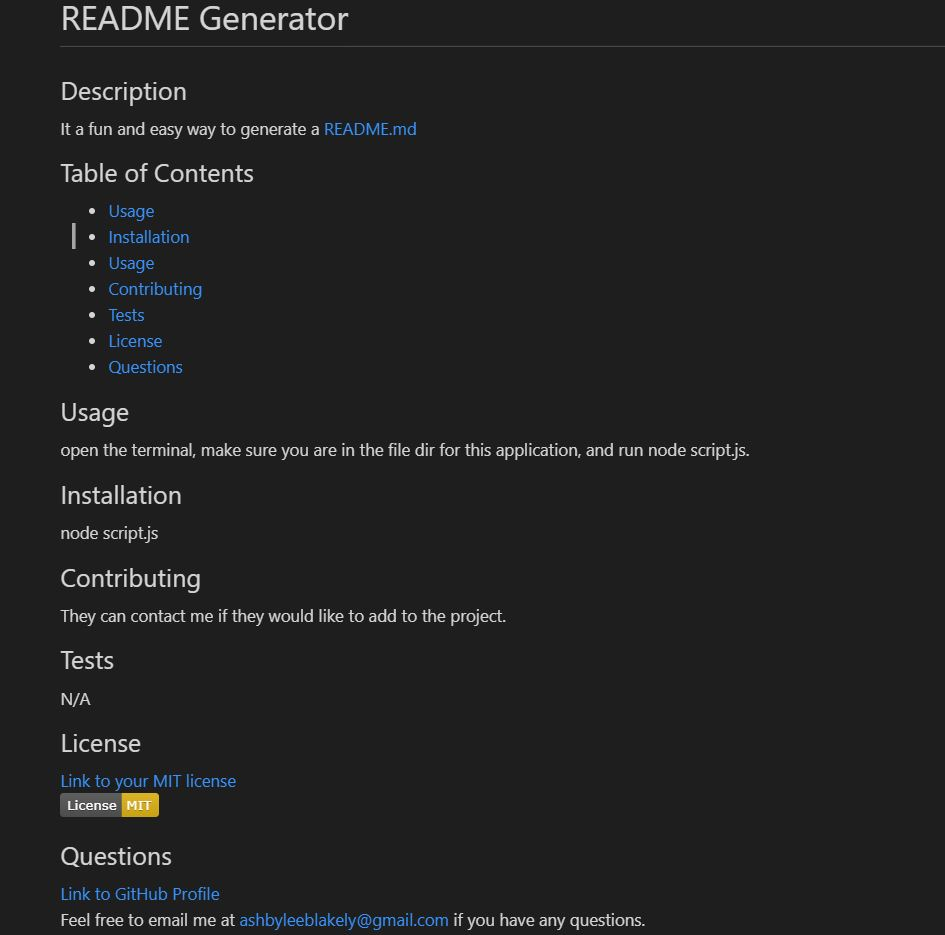

# README Generator
    
## Description
Using prompts from the terminal, generate your own professional README.

## Table of Contents
- [Usage](#Usage)
- [Installation](#Installation)
- [Usage](#Usage)
- [Contributing](#Contributing)
- [Screenshot](#Screenshot)
- [License](#License)
- [Questions](#Questions)

## Usage
You can use this program to quickly and effeciently creat a readme based on your feedback when prompted to respond to questions in the terminal. 

## Installation
In the program dir, use node to begin the program.  node scropt.js

## Contributing 
Ashby Blakely 

## Screenshot

## License
MIT

## Questions
[Link to GitHub Profile](https://github.com/AshbyLB) 
Feel free to email me at ashbyleeblakely@gmail.com if you have any questions.

    